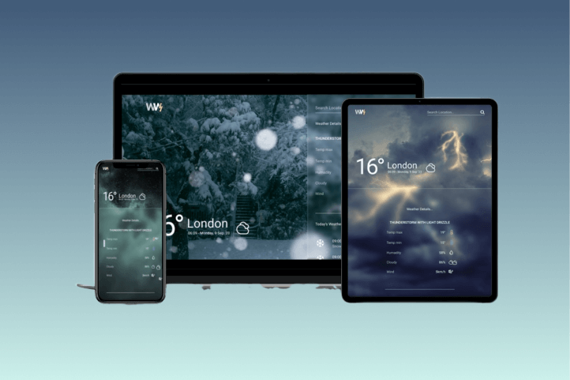

# Weather Web



A responsive website to find out weather in the world

Check my design at my [figma comunity](https://www.figma.com/community/file/1300997022541611628/weather-web)

I use api from [openweahtermap](https://openweathermap.org) to find weather in every location

- geocoding api
- current weather api
- 3-hour forecast 5 days api

<br>

### Content

- [Start](#start-your-own-weather-web)
- [Source](#source)

<br>
<br>

## Start Your Own Weather Web ⛅

- Get api key, you must register at [openweahtermap](https://openweathermap.org/home/sign_up) to get your api key
- Download repo or fork this repo and open with your favorite code editor.
- Install All Dependencies, `npm install` to install all dependencies
- create `.env` file and make variables

  ```
  // .env

  API_KEY="(Your api key)"
  PORT=3000

  ```

- `npm run dev `to see your app on server

  ```
  npm run dev

  // result
  Your app listening at http://localhost:3000
  ```

## Source

### Icons

- [figma comunity](https://www.figma.com/community/file/1059229179375580154/weather-icons-kit)
- [iconify](https://iconify.design/)

### Background Images

- [unsplash](https://unsplash.com/)
