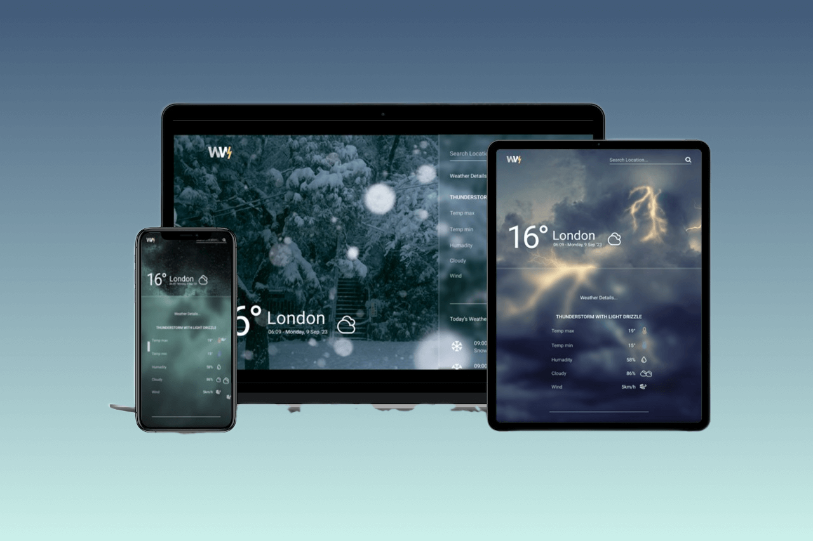

# Weather Web



A responsive website to find out weather in the world, including at your location

I use api from [openweahtermap](https://openweathermap.org) to find weather in every location

- geocoding api
- current weather api
- 3-hour forecast 5 days api

<br>

### Content

- [Start](#start-your-own-weather-web)
- [Source](#source)

<br>
<br>

## Start Your Own Weather Web ⛅

---

### Get Api key

You must register on [openweahtermap](https://openweathermap.org/home/sign_up) to get your api key

<br>

### Download Repository

Download repo and open with your favorite code editor. You can download with zip or fork this repo

<br>

### Intall All Dependencies

`npm install` to install all dependencies

```
npm install
```

<br>

### Create .env File

create .env file and make variables

```
// .env

API_KEY="(Your api key)"
PORT=3000

```

<br>

### See Your Own Weather Web

`npm run dev `to see your app on server

```
npm run dev

// result
Your app listening at http://localhost:3000
```

<br>

### Tips 💡

You can styling your own Weather Web at `src/sass/abstract/_tokens.scss` Most of styling css can control at this file

<br>

## Source

---

### Icons

- [figma comunity](https://www.figma.com/community/file/1059229179375580154/weather-icons-kit)
- [iconify](https://iconify.design/)

### Background Image

- [unsplash](https://unsplash.com/)
